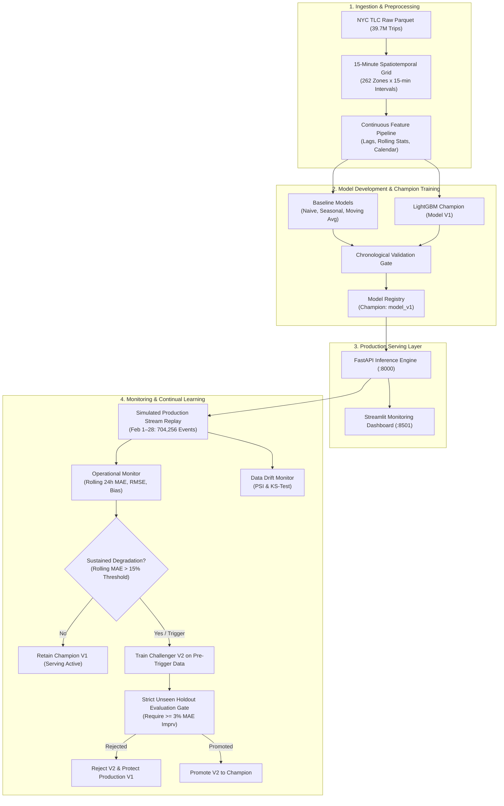

# NYC Ride Demand Prediction with Continual Learning

An end-to-end Machine Learning, MLOps, and real-time forecasting system built on **39.7 million NYC Taxi & Limousine Commission (TLC) High Volume For-Hire Vehicle (HVFHV) Trip Records** across January and February 2025.

---

## 1. Project Overview

This project implements a production-grade spatiotemporal demand forecasting and continual learning platform for urban ride-hailing services. Rather than assuming Machine Learning is automatically necessary, the system experimentally benchmarks ML models against strong statistical and temporal baselines, replays an unseen simulated production stream across 262 pickup zones, monitors feature stability and operational degradation, and enforces an automated Champion–Challenger validation gate.

---

## 2. Problem Statement

Predict the number of ride requests originating from each of the ~262 NYC TLC pickup zones in **15-minute intervals** using `request_datetime` and `PULocationID`.

- **Target Variable**: Demand = Total ride requests per zone per 15-minute interval.
- **Granularity**: 262 pickup zones $\times$ 96 intervals/day (2,976 intervals in Jan, 2,688 intervals in Feb).
- **Core Challenge**: Accurately forecasting volatile demand peaks and turning points without temporal leakage while ensuring deployed models remain robust over time.

---

## 3. System Architecture



---

## 4. Dataset

The project uses the official **NYC TLC High Volume For-Hire Vehicle (HVFHV)** trip records (Uber, Lyft):

- **January 2025 (Baseline / Development)**:
  - Raw Records: 20,405,666 rows (491 MB Parquet).
  - Cleaned & Filtered: 20,404,497 trips within `2025-01-01` to `2025-02-01`.
  - Spatiotemporal Grid: $2,976 \text{ intervals} \times 262 \text{ zones} = 779,712 \text{ rows}$.
- **February 2025 (Unseen Production Stream)**:
  - Raw Records: 19,339,461 rows (461 MB Parquet).
  - Cleaned & Filtered: 19,336,129 trips within `2025-02-01` to `2025-03-01`.
  - Spatiotemporal Grid: $2,688 \text{ intervals} \times 262 \text{ zones} = 704,256 \text{ rows}$.

---

## 5. Feature Engineering

Features are computed strictly backwards in time to guarantee **zero future lookahead leakage**:

- **Autoregressive Lags**: $t-1$ (15 min), $t-2$ (30 min), $t-4$ (1 hour), $t-8$ (2 hours), $t-96$ (24 hours / yesterday), $t-672$ (7 days / last week).
- **Short-Term Demand Trend**: $y_{t-1} - y_{t-2}$ (15-minute momentum).
- **Rolling Historical Statistics**: Rolling Mean and Standard Deviation over past 4 intervals (1 hour) and past 8 intervals (2 hours), calculated strictly over the shifted series $t-1, t-2, \dots$.
- **Temporal Calendar Encodings**: Hour of day (0–23), Minute bucket (0, 15, 30, 45), Day of week (0=Mon, 6=Sun), Weekend indicator (0/1), Time slot of day (0–95).
- **Spatial Identifier**: `PULocationID` (categorical zone index).

---

## 6. Models & Baseline Progression

To ensure Machine Learning is justified, we benchmarked against three strong non-ML baselines:

1. **Baseline A: Naive Last-Period**: $\hat{y}_t = y_{t-1}$.
2. **Baseline B: Historical Seasonal Lookup**: Predicts the historical mean for `(PULocationID, day_of_week, 15min_slot)` learned strictly on the training set.
3. **Baseline C: Moving Average (1-hour)**: Rolling mean of past 4 intervals strictly prior to $t$.
4. **Machine Learning Model (LightGBM Champion V1)**: Gradient Boosted Decision Tree with Huber/L1 loss, 250 estimators, learning rate 0.08, num_leaves 63.

---

## 7. Experimental Results

### January Test Set Evaluation (Jan 26–31, 2025):

| Model | Test MAE | Test RMSE | Prediction Bias | WAPE | % MAE Improvement vs Naive |
|---|---|---|---|---|---|
| **Baseline A: Naive ($t-1$)** | 5.5234 | 8.8132 | +0.0323 | 0.2139 | Baseline (0.00%) |
| **Baseline B: Historical Seasonal** | 5.2517 | 9.0949 | -0.0306 | 0.2034 | +4.92% |
| **Baseline C: Moving Average (1h)** | 5.3407 | 8.9024 | +0.0445 | 0.2069 | +3.31% |
| **Machine Learning (LightGBM V1)** | **4.3721** | **7.2381** | **+0.0547** | **0.1694** | **+20.84% ⭐** |

### February Unseen Production Stream Evaluation (Feb 1–28, 2025):

| Metric | January Validation Benchmark | February Unseen Stream Actual | Operational Variance |
|---|---|---|---|
| **Mean Absolute Error (MAE)** | 4.4896 | **4.4509** | **-0.0387** (Better generalization) |
| **Root Mean Squared Error (RMSE)** | 7.3836 | **7.2990** | **-0.0846** (Lower error dispersion) |
| **Mean Prediction Bias** | -0.2373 | **-0.1033** | Near-zero systematic bias |
| **WAPE** | 0.1570 | **0.1621** | 16.2% relative error across 704k predictions |

---

## 8. Simulated Production Stream

> **Important Operational Note**: **February historical data is replayed chronologically to simulate a real-time production environment.** This is not connected to a live NYC TLC API feed.

- **Replay Engine**: Steps chronologically through all 2,688 15-minute intervals ($704,256$ predictions across 262 zones).
- **Latency**: Sub-5ms inference per zone, ~18 seconds for full-month re-simulation.
- **Audit Logging**: Persisted to `data/processed/stream_predictions.parquet` (855,168 unified records).

---

## 9. Performance & Drift Monitoring

- **Operational Trigger Policy**: A **15% degradation threshold** above January validation baseline (**5.1630 MAE**) was configured as the operational limit.
- **Peak Rolling Error**: Rolling 24-hour MAE peaked at **5.0354** (+12.1%) on **February 16 (Presidents' Day weekend)**, remaining safely below the 15% trigger.
- **Data Drift Profiling (PSI & KS-Test)**:
  - `lag_1`: $\text{PSI} = 0.0012$ (Stable)
  - `lag_96`: $\text{PSI} = 0.0008$ (Stable)
  - `rolling_mean_4`: $\text{PSI} = 0.0013$ (Stable)
- **Scientific Interpretation**: Feature drift and prediction-performance changes are treated as **evidence of potential concept drift**, rather than asserting mathematical certainty.

---

## 10. Continual Learning & Model Governance

- **Workflow**:
  1. Performance monitoring tracks rolling metrics.
  2. If sustained degradation occurs $\rightarrow$ trigger candidate training on pre-trigger data.
  3. Candidate Challenger is evaluated on a **strictly subsequent, genuinely unseen holdout window**.
  4. Champion–Challenger Gate requires $\ge 3.0\%$ overall MAE improvement and $\le 2.0\%$ high-zone regression.

---

## 11. Final Governance Result

In a simulated mid-month retraining event (trained on Feb 1–15, evaluated on unseen Feb 16–20 holdout):
- **Champion (Model V1) Holdout MAE**: **4.3407**
- **Challenger (Model V2) Holdout MAE**: **4.4056**
- **Observed Improvement**: **-1.50%** (Challenger was worse than Champion V1)
- **Required Improvement**: **+3.00%**
- **Governance Decision**: **REJECT CHALLENGER & RETAIN MODEL V1**.
- **Takeaway**: The governance gate successfully protected production from deploying an inferior retrained model.

---

## 12. FastAPI Backend Endpoints

The API is accessible at `http://localhost:8000` (Swagger UI at `http://localhost:8000/docs`):

| Method | Endpoint | Description |
|---|---|---|
| `GET` | `/health` | Health check and operational status |
| `GET` | `/model` | Active Champion model info, training window, and registry lineage |
| `POST` | `/predict` | Predict 15-minute demand for a specific zone and timestamp |
| `GET` | `/monitoring` | Operational metrics (rolling MAE, RMSE, bias, degradation status) |
| `GET` | `/drift` | Feature drift PSI and KS-test statistics |
| `GET` | `/governance` | Champion vs Challenger gate evaluation and audit history |

### Example Prediction Request:
```bash
curl -X POST "http://localhost:8000/predict" \
     -H "Content-Type: application/json" \
     -d '{"zone": 138, "timestamp": "2025-02-20 18:00:00"}'
```

---

## 13. Streamlit Dashboard

The production dashboard is accessible at `http://localhost:8501`:

- 🏢 **Overview**: System status badges, production KPIs, and benchmark summaries.
- 🎯 **Demand Prediction**: Interactive zone and date/time selector with sub-5ms inference and actual vs predicted timeline charts.
- 🗺️ **NYC Demand Explorer**: Top pickup zones, diurnal hourly cycles, and day-of-week demand distributions.
- 📈 **Model Monitoring**: Rolling 24h & 3-day MAE vs configured 15% degradation alert limits and rolling bias.
- 🔍 **Drift Detection**: Feature-by-feature PSI and KS-test table with status badges (🟢 Stable, 🟡 Moderate, 🔴 Drift).
- ⚖️ **Model Governance**: Champion vs Challenger side-by-side gate evaluation, audit decision card, and model lineage timeline.
- ⏱️ **Simulated Real-Time Mode**: Interactive slider stepping through historical February intervals with live inference and delayed ground-truth arrival.

---

## 14. Running Locally

### 1. Prerequisites:
```bash
python -m venv .venv
source .venv/bin/activate  # On Windows: .venv\Scripts\activate
pip install -r requirements.txt
```

### 2. Run Test Suite:
```bash
python -m tests.test_pipeline
python -m tests.test_api
```

### 3. Start FastAPI Backend:
```bash
python -m uvicorn api.main:app --host 0.0.0.0 --port 8000 --reload
```

### 4. Start Streamlit Dashboard:
```bash
python -m streamlit run dashboard/app.py --server.port 8501
```


---

## 15. Docker Deployment

### 1. Run via Docker Compose:
```bash
docker compose up --build
```

### 2. Access Services:
- **FastAPI Documentation**: [http://localhost:8000/docs](http://localhost:8000/docs)
- **Streamlit Dashboard**: [http://localhost:8501](http://localhost:8501)

### 3. Stop Services:
```bash
docker compose down
```

---

## 16. Project Structure

```
demand_prediction/
├── api/
│   ├── __init__.py
│   ├── main.py                             # FastAPI application & routes
│   ├── schemas.py                          # Pydantic request/response schemas
│   └── services.py                         # ML inference, monitoring, & governance service
├── dashboard/
│   └── app.py                              # Streamlit 7-page interactive dashboard
├── data/
│   ├── raw/                                # Raw TLC parquet files (gitignored)
│   │   ├── fhvhv_tripdata_2025-01.parquet  # 20.4M rows (January)
│   │   └── fhvhv_tripdata_2025-02.parquet  # 19.3M rows (February)
│   └── processed/
│       ├── demand_15min_2025_01.parquet    # January grid (779,712 rows)
│       ├── demand_15min_2025_02.parquet    # February grid (704,256 rows)
│       └── stream_predictions.parquet      # Unified predictions (855,168 rows)
├── models/
│   ├── model_v1.joblib                     # Deployed Production Champion (LightGBM)
│   ├── model_v2_feb.joblib                 # Evaluated Challenger model
│   └── model_registry.json                 # Model version lineage & audit registry
├── notebooks/
│   ├── 01_data_understanding.ipynb         # Data profiling & schema inspection
│   ├── 02_eda.ipynb                        # 10 targeted spatiotemporal analyses
│   ├── 03_baseline_model.ipynb             # Naive, Seasonal, & Moving Average baselines
│   ├── 04_ml_model.ipynb                   # Feature pipeline & ML benchmark comparison
│   ├── 05_stream_simulation.ipynb          # January test stream replay
│   ├── 06_performance_monitoring.ipynb     # January monitoring & drift detection
│   ├── 07_continual_learning.ipynb         # Initial Champion-Challenger validation
│   └── 08_february_production_stream.ipynb # February simulated production stream
├── reports/
│   └── figures/                            # Publication-quality monitoring plots
├── scripts/
│   ├── build_demand_dataset.py             # Precomputes January grid
│   ├── build_february_demand.py            # Precomputes February grid
│   ├── generate_notebooks.py               # Generates notebooks 01 to 07
│   ├── generate_february_notebook.py       # Generates notebook 08
│   ├── run_experiments.py                  # End-to-end January pipeline runner
│   └── run_february_production_stream.py   # February production stream & continual learning
├── src/
│   ├── __init__.py
│   ├── config.py                           # Central configuration & trigger policies
│   ├── data_loader.py                      # Columnar data ingestion & grid aggregation
│   ├── features.py                         # Continuous lag & rolling feature pipeline
│   ├── baselines.py                        # Naive, Seasonal, & Moving Average baselines
│   ├── metrics.py                          # MAE, RMSE, Bias, WAPE, & subgroup evaluators
│   ├── drift.py                            # PSI, KS-test, & sustained degradation detector
│   └── continual.py                        # ModelRegistry & Champion-Challenger gate
├── tests/
│   ├── test_pipeline.py                    # Pipeline unit tests
│   └── test_api.py                         # FastAPI endpoint unit tests
├── Dockerfile                              # Multi-service container specification
├── docker-compose.yml                      # Container orchestration for API & Dashboard
├── requirements.txt                        # Pinned dependencies
├── .dockerignore
├── .gitignore
└── README.md
```

---

## 17. Limitations

1. **Historical Replay vs Live Streaming**: February data is replayed chronologically to simulate a production environment; it is not a direct live streaming websocket from the TLC dispatch systems.
2. **Temporal Window**: Models are currently evaluated on January and February 2025.
3. **No External Weather / Transit Telemetry**: Predictions rely strictly on endogenous demand lags and calendar encodings without external weather or subway delay feeds.
4. **Spatial Granularity**: Forecasting is conducted at the TLC Taxi Zone level (262 zones) rather than exact latitude/longitude coordinates.
5. **Fixed 15-Minute Horizon**: The current system optimizes for short-term 15-minute operational dispatch.

---

## 18. Future Improvements

- **Live Kafka / Redpanda Ingestion**: Connecting to streaming event brokers for true sub-second ingestion.
- **Multimodal Exogenous Signals**: Ingesting NOAA live weather data, MTA transit disruption feeds, and NYC major event calendars.
- **Hierarchical Spatiotemporal GNNs**: Exploring Graph Neural Networks over the NYC road network adjacency matrix.
- **Dynamic Online Retraining**: Incremental gradient updates alongside batch Champion-Challenger validation gates.
- **Cloud Kubernetes Deployment**: Helm charts and Terraform templates for AWS EKS / GCP GKE cluster deployments.
