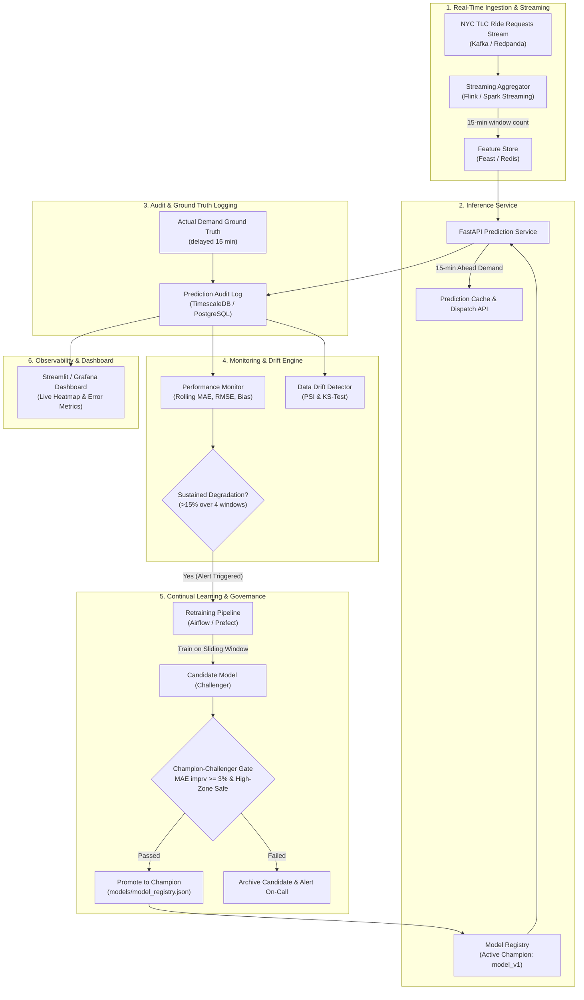

# Real-Time Ride Demand Prediction with Continual Learning

An end-to-end Machine Learning and MLOps system built on **20.4 million NYC Taxi & Limousine Commission (TLC) High Volume For-Hire Vehicle (HVFHV) Trip Records (January 2025)**.

---

## 🎯 Project Philosophy

> **Do NOT assume Machine Learning is automatically necessary.**

The first objective of this project is to determine experimentally whether ML provides meaningful improvement over strong simple forecasting baselines. We follow a strict progression:

1. **Data Understanding**: Memory-efficient profiling of 20.4M records without loading unnecessary columns.
2. **Exploratory Data Analysis (EDA)**: 10 targeted spatiotemporal analyses evaluating whether 15-minute zone-level demand is predictable.
3. **Demand Dataset Creation**: Constructing a complete 15-minute regular grid ($2,976 \text{ intervals} \times 262 \text{ zones} = 779,712 \text{ rows}$) with zero-filling.
4. **Strong Simple Baselines**: Naive ($t-1$), Historical/Seasonal (lookup table), and Moving Average baselines under strict chronological splits.
5. **Machine Learning Model**: Leak-free lag, rolling, and temporal feature engineering with LightGBM / Gradient Boosting.
6. **Fair Evaluation**: Comprehensive comparison table (MAE, RMSE, Bias, WAPE, % improvement) and subgroup breakdowns (high vs low demand zones, peak vs off-peak).
7. **Real-Time Stream Simulation**: Historical data replay engine simulating 15-minute streaming prediction and delayed ground truth arrival.
8. **Performance Monitoring**: Tracking rolling 24-hour MAE, RMSE, and Prediction Bias.
9. **Drift Detection**: Population Stability Index (PSI) and Kolmogorov-Smirnov (KS) tests, distinguishing **Data Drift** $P(X)$ from **Concept Drift** $P(Y|X)$.
10. **Continual Learning**: Controlled Champion-Challenger evaluation gate preventing unvalidated model deployments.
11. **Production Architecture**: Scalable, microservices-based design using FastAPI, TimescaleDB/PostgreSQL, Streamlit, and Docker.

---

## 📁 Repository Structure

```
demand_prediction/
├── data/
│   ├── raw/                                # Raw TLC trip records (untouched)
│   │   ├── fhvhv_tripdata_2025-01.parquet  # 20.4M rows (January baseline)
│   │   └── fhvhv_tripdata_2025-02.parquet  # 19.3M rows (February production stream)
│   └── processed/
│       ├── demand_15min_2025_01.parquet    # January regular grid (779,712 rows)
│       ├── demand_15min_2025_02.parquet    # February regular grid (704,256 rows)
│       └── stream_predictions.parquet      # Audit logs (855,168 unified predictions)
├── models/
│   ├── model_v1.joblib                     # Deployed Production Champion (LightGBM)
│   ├── model_v2.joblib                     # January challenger experiment
│   ├── model_v2_feb.joblib                 # February candidate challenger
│   └── model_registry.json                 # Version control, lineage, and gate decisions
├── notebooks/
│   ├── 01_data_understanding.ipynb         # Memory-conscious profiling & boundary verification
│   ├── 02_eda.ipynb                        # 10 targeted spatial & temporal analyses
│   ├── 03_baseline_model.ipynb             # Naive, Historical Seasonal, & Moving Average baselines
│   ├── 04_ml_model.ipynb                   # Feature pipeline, ML training, & comparison table
│   ├── 05_stream_simulation.ipynb          # January test stream replay
│   ├── 06_performance_monitoring.ipynb     # January monitoring & drift detection
│   ├── 07_continual_learning.ipynb         # Initial Champion-Challenger validation
│   └── 08_february_production_stream.ipynb # February simulated production stream & governance
├── reports/
│   └── figures/                            # Publication-quality monitoring plots
├── scripts/
│   ├── build_demand_dataset.py             # Generates January 15-minute grid
│   ├── build_february_demand.py            # Generates February 15-minute grid
│   ├── generate_notebooks.py               # Generates notebooks 01 to 07
│   ├── generate_february_notebook.py       # Generates notebook 08
│   ├── run_experiments.py                  # January pipeline runner
│   └── run_february_production_stream.py   # February production stream & continual learning
├── src/
│   ├── config.py                           # Configuration & operational trigger policies
│   ├── data_loader.py                      # Columnar reading & grid aggregation
│   ├── features.py                         # Continuous lag & rolling feature pipeline
│   ├── baselines.py                        # Naive, Seasonal, & Moving Average baselines
│   ├── metrics.py                          # MAE, RMSE, Bias, WAPE, & subgroup evaluators
│   ├── drift.py                            # PSI, KS-test, & sustained degradation detector
│   └── continual.py                        # ModelRegistry & Champion-Challenger gate
├── tests/
│   └── test_pipeline.py                    # Automated unit tests
└── README.md
```

---

## 🔬 Benchmark Comparison Results (January Baseline Test: Jan 26–31, 2025)

| Model | Test MAE | Test RMSE | Prediction Bias | WAPE | % MAE Improvement vs Naive |
|---|---|---|---|---|---|
| **Baseline A: Naive ($t-1$)** | 5.5234 | 8.8132 | +0.0323 | 0.2139 | Baseline (0.00%) |
| **Baseline B: Historical Seasonal** | 5.2517 | 9.0949 | -0.0306 | 0.2034 | +4.92% |
| **Baseline C: Moving Average (1h)** | 5.3407 | 8.9024 | +0.0445 | 0.2069 | +3.31% |
| **Machine Learning (LightGBM)** | **4.3721** | **7.2381** | **+0.0547** | **0.1694** | **+20.84%** |

---

## 🚀 February 2025: Simulated Production Stream & Model Governance

> **Important Operational Disclaimer**: **February historical data is replayed chronologically to simulate a production environment.** This is not live streaming data.

### 1. Data Roles:
- **January 2025**: Acts as historical baseline data used for training (Jan 8–20) and initial validation (Jan 21–25) to produce the deployed Champion (**Model V1**).
- **February 2025**: Acts as **unseen production data** replayed interval-by-interval ($2,688 \text{ intervals} \times 262 \text{ zones} = 704,256 \text{ spatio-temporal predictions}$) to simulate a live operational environment.

### 2. Operational Performance of Deployed Model V1:
Model V1 was deployed without any initial retraining and evaluated on the entire unseen February stream:
- **February Overall MAE**: **4.4509** (outperforming its January validation benchmark of 4.4896)
- **February Overall RMSE**: **7.2990** (outperforming January validation of 7.3836)
- **Mean Prediction Bias**: **-0.1033** rides per 15-min interval
- **WAPE**: **0.1621**

### 3. Drift Monitoring (Evidence of Potential Concept Drift):
- **Feature Stability (Data Drift)**: Monitored via Population Stability Index (PSI) and Kolmogorov-Smirnov (KS) tests between the January training reference and incoming February windows:
  - `lag_1`: $\text{PSI} = 0.0012$ (Stable)
  - `lag_96`: $\text{PSI} = 0.0008$ (Stable)
  - `rolling_mean_4`: $\text{PSI} = 0.0013$ (Stable)
- **Scientific Interpretation**: Feature drift and prediction-performance changes are used as **evidence of potential concept drift**, avoiding claims of absolute mathematical certainty.

### 4. Event-Triggered Continual Learning & Safety Gate:
- **Operational Trigger Policy**: A 15% degradation threshold above January validation baseline (Limit = 5.1630 MAE) was selected as the configured operational trigger.
- **Degradation Check**: Rolling 24-hour MAE peaked at **5.0354** (+12.1%) during Presidents' Day weekend (Feb 16), remaining within operational limits. Model V1 continued serving in production.
- **Champion–Challenger Gate on Strictly Unseen Holdout**:
  To empirically test the continual learning gate, a mid-month Challenger model (`model_v2_feb`) was trained strictly on pre-trigger data (Feb 1–15) and evaluated against Champion Model V1 on a **strictly subsequent, genuinely unseen holdout window (Feb 16–20)**:
  - **Champion (Model V1) Holdout MAE**: **4.3407**
  - **Challenger (Model V2) Holdout MAE**: **4.4056**
  - **Improvement**: **-1.50%**
  - **Gate Decision**: **REJECT CHALLENGER & RETAIN MODEL V1**. The safety gate successfully prevented deploying an inferior model.


---

## ⚙️ Step 13: Production Architecture Design



### Production Stack:
- **Serving**: FastAPI asynchronous REST endpoint serving 15-minute zone forecasts with < 20ms p99 latency.
- **Storage**: TimescaleDB / PostgreSQL for time-series indexed prediction audit tables.
- **Orchestration**: Airflow / Prefect for automated sliding-window retraining DAGs.
- **Dashboard**: Streamlit / Plotly for real-time demand heatmaps and drift dashboards.
